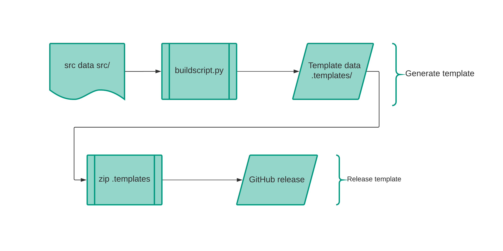
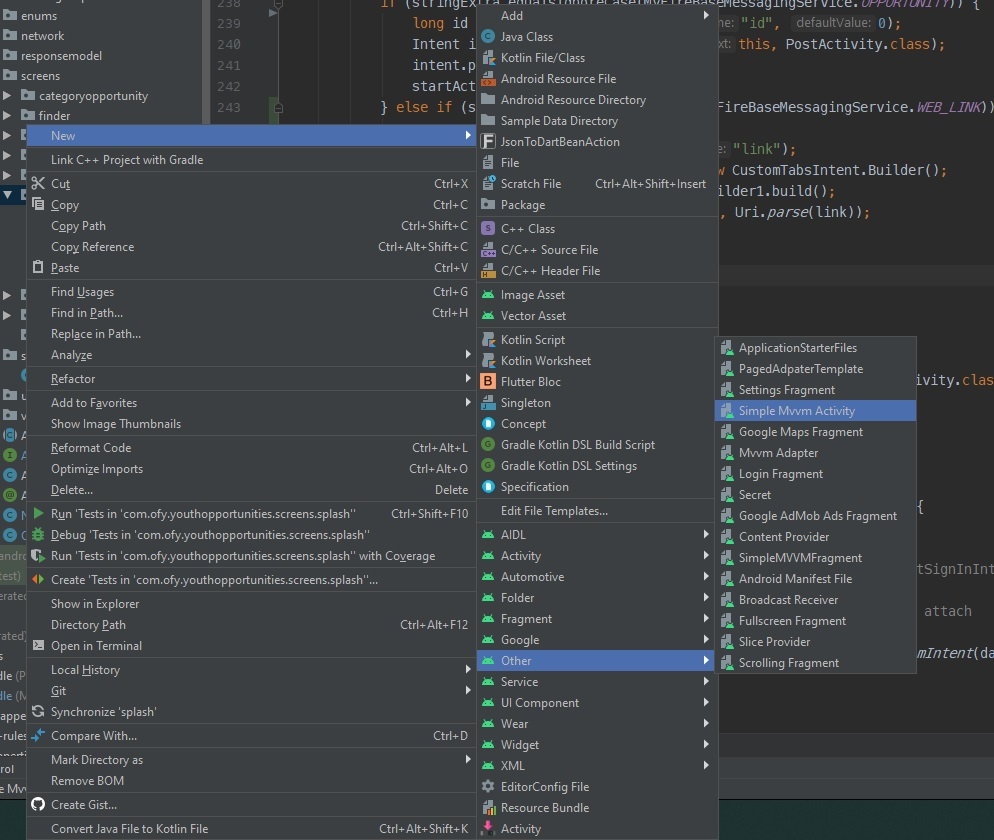

# Android Studio Template

This project is on very early stage.

### How this project generate templates.

### how to generate the templates in your own system

1. Clone this repo.
2. run python buildscript.py
3. copy .templates/ to your android templates directory.

# For Android Studio < 2.2

--------
 
### For Mac:

Just copy all files from .templates/ to `$ANDROID_STUDIO_FOLDER$/Contents/plugins/android/lib/templates/other/$CUSTOM_TEMPLATE_FOLDER$`

### For Windows:

Just copy all files from .templates/ to `$ANDROID_STUDIO_FOLDER$\plugins\android\lib\templates\other\$CUSTOM_TEMPLATE_FOLDER$`

  

# For Android Studio >= 2.2

--------

### For Mac:

Just copy all files from .templates/ to `$ANDROID_STUDIO_FOLDER$/plugins/android/lib/templates/other/$CUSTOM_TEMPLATE_FOLDER$`

### For Windows:

Just copy all files from .templates/ to `$ANDROID_STUDIO_FOLDER$\plugins\android\lib\templates\other\$CUSTOM_TEMPLATE_FOLDER$`

